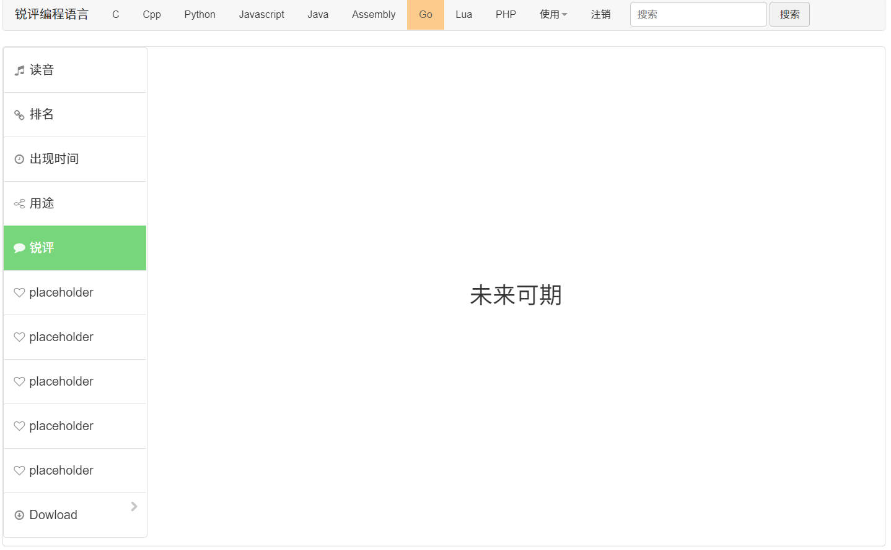
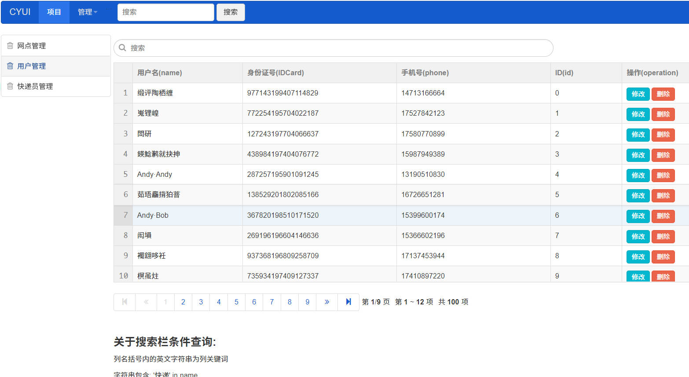
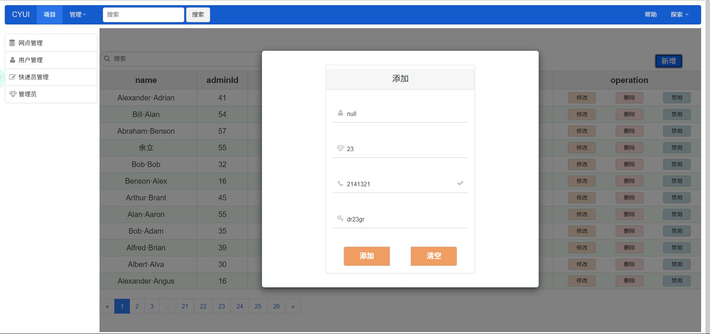

## 简介
一个[zui](https://github.com/easysoft/zui)写的一些小demo，总之最大的用途是完成作业，没有实际功能  
work2内含登录及导航、菜单例子   
work3主要是数据表格、表格数据请求与展示更新、借助js语法的条件查询  

## work2预览
**登录**

**主页**

## work3预览
**条件查询**

**支持的条件(部分)**
列名括号内的英文字符串为列关键词  
字符串包含: '快递' in name  
小于: id < 8  
大于: id > 8  
等于: adminId = 8  
多条件: id < 8 || adminId = 8 && '快递' in name  
特殊查询(字符串): phone.startsWith('139')  

## work4预览
**管理员添加模态框**
  
该页面的table由zui栅格系统模拟

## 后话
work2里本想用那个Bootbox代替alert，结果依赖一大堆真麻烦  
work3中的iframe真的折磨，不易操作、交换信息，耗时还严重，就这还要求条件查询，要不是作业真不想用这个    
